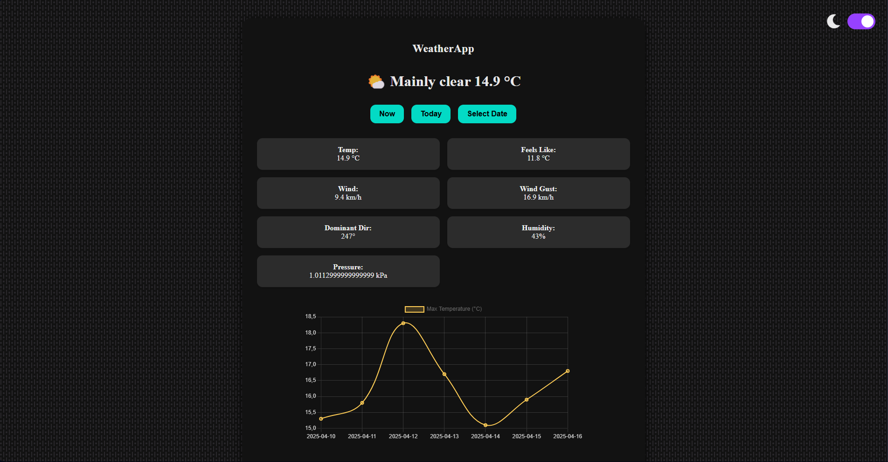
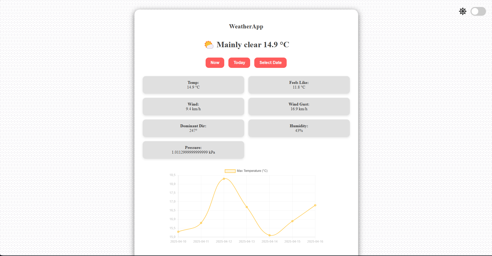

# 🌤️ MyWeatherApp

A simple and modern weather forecast web app built with vanilla JavaScript, HTML, and CSS.  
It fetches real-time weather data from the [Open-Meteo API](https://open-meteo.com/) and supports dark/light mode.

---

## 🚀 Features

- 📍 Shows current weather for Thessaloniki
- 🌡️ Daily and hourly temperature info
- 📊 Interactive temperature charts using Chart.js
- 🌓 Dark/Light mode toggle (saved in localStorage)
- 📅 Date picker to view historical forecast (up to 7 days)

---

## 🛠️ Built With

- HTML5
- CSS3 (Custom properties, Flex/Grid)
- JavaScript (ES6+)
- Chart.js
- Open-Meteo API

---

## 📸 Preview





## 🔗 Visit the App

[🌐 MyWeatherApp Live](https://margout404.github.io/MyWeatherApp/)

---

## 🔧 How to Run Locally

1. Clone the repository:
   ```bash
   git clone https://github.com/Margout404/MyWeatherApp.git
